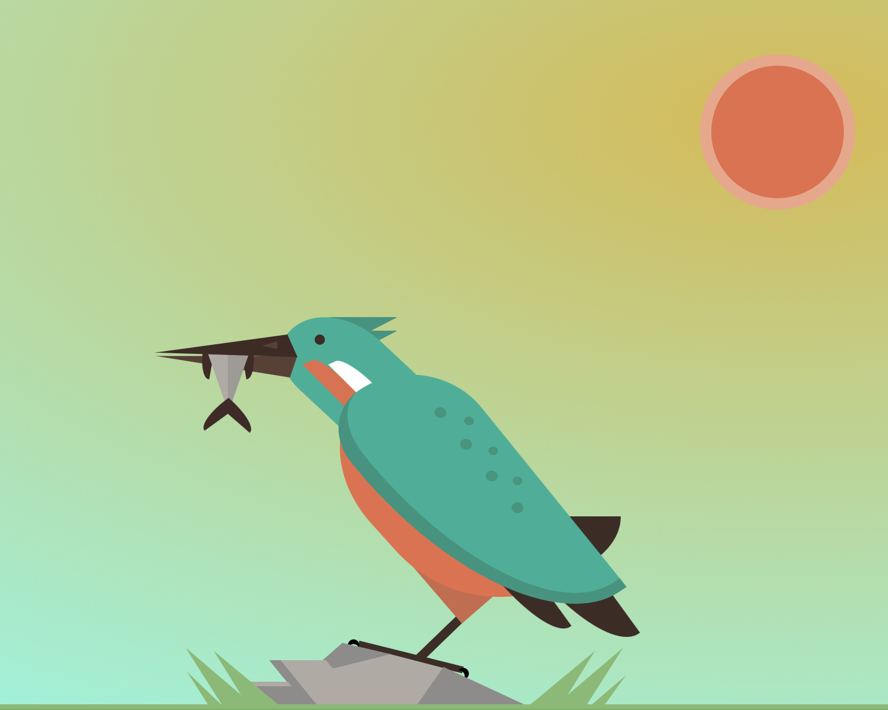

# Pure CSS bird

[LIVE DEMO](https://marclopezavila.github.io/pure-css-bird/)

[CODEPEN](https://codepen.io/Loopez10/pen/JXwoPb)

A drawing of a bird using only CSS. It's my first drawing in CSS and I spent like an entire afternoon doing it. Hope you like it!

